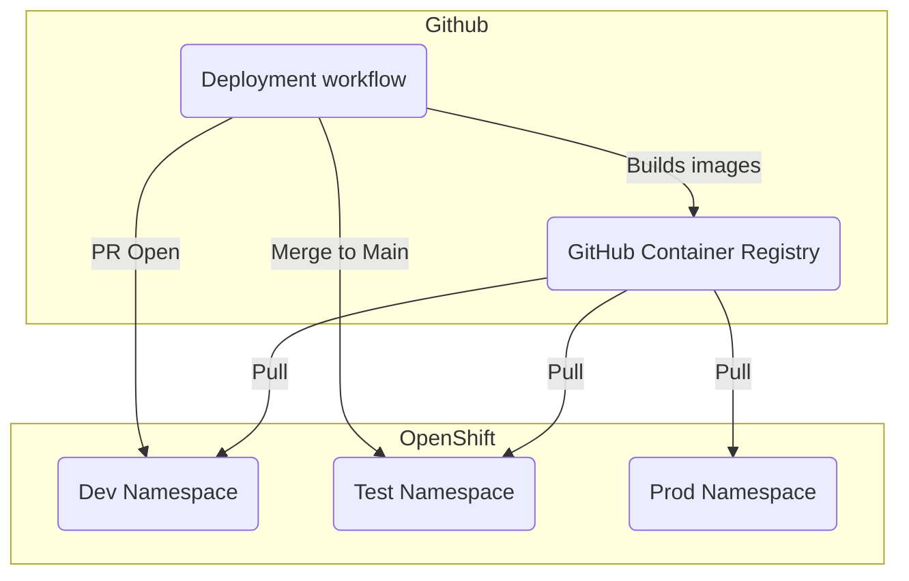
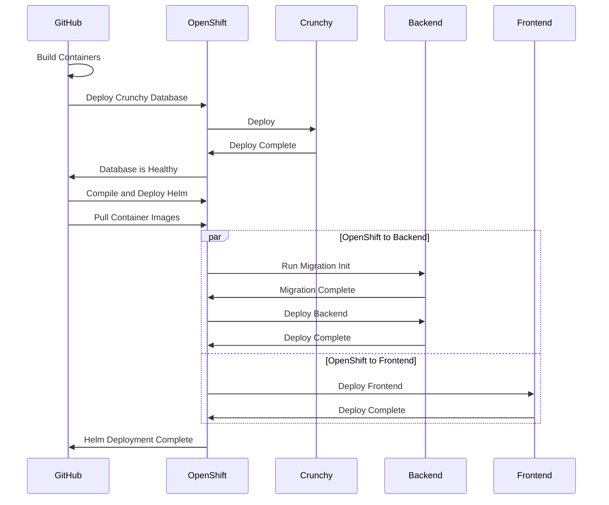
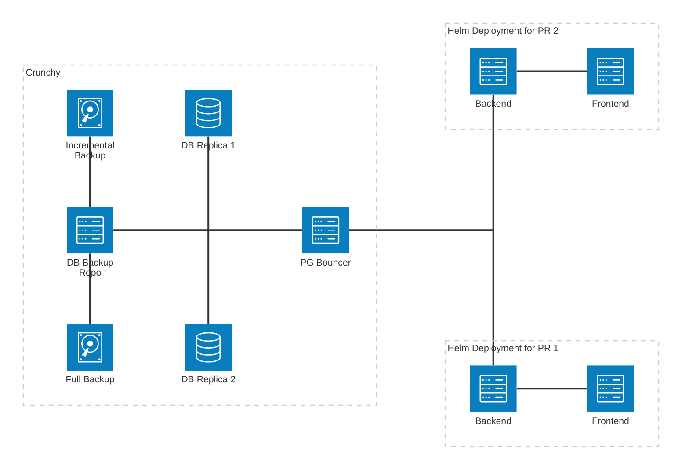
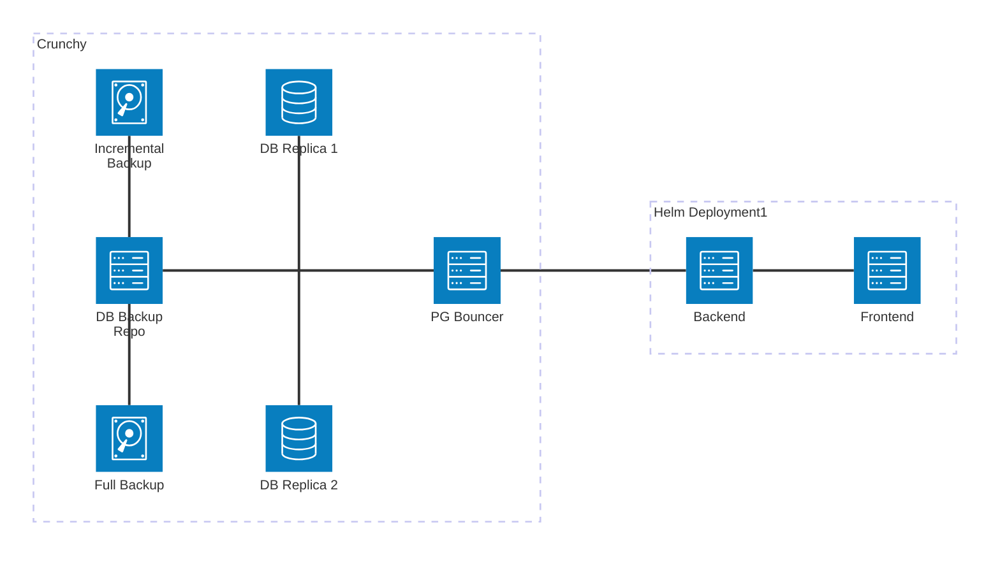
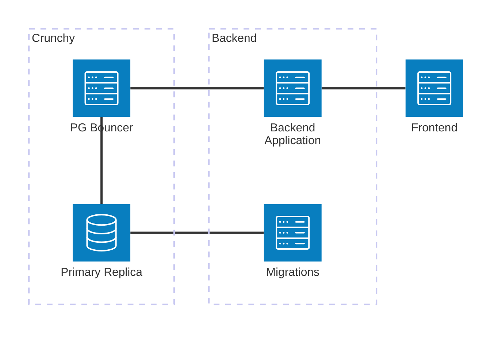
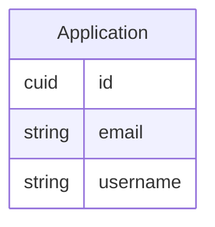
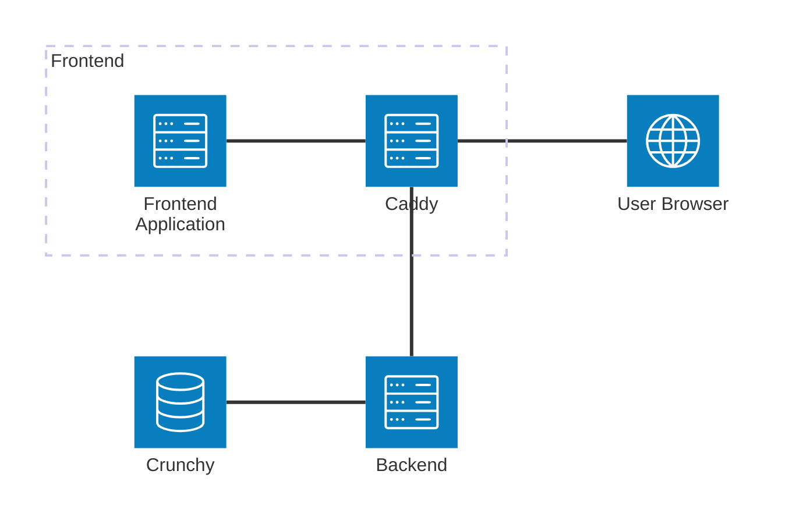

# Application Architecture

There are quite a few interlocking components here so I will do my best to
explain what they do and how they all relate to one another. They generally fall
into one of three categories:

1. CI/CD (The "operations" part of devops)
2. Backend
3. Frontend

## CI/CD

This component of the application is responsible for automating the build, test,
and deployment of the application. It uses a combination of GitHub actions and
Helm to manage the deployment of the application.

### The Relationship Between GitHub Actions and OpenShift

### Deployment Sequence

### Dev Environment Topology

### Test/Prod Environment Topology

### Github Actions

The code for our GitHub actions is located in `.github/workflows`. They are
responsible for:

1. Building the container images.
1. Pushing the container images to the GitHub Container Registry.
1. Testing and analysing the code.
1. Triggering the deploy of our database with the `bcgov/action-crunchy` action.
1. Triggering the deployment of the frontend and backend on OpenShift.
1. Cleaning up images and deployments

Deployments to Dev occur on PR Open. Deployments to Test occur when a pull
request is merged to main. Prod deployments will need to be triggered manually
specifying container versions to use.

TODO: figure out how Prod deploy actually works.

### Helm and OpenShift

This is our hosting platform. All of our code runs here. OpenShift is an open
source management tool for kubernetes deployments (among other things). The
deployments are configured using the open source tool `helm` which generates
the kubernetes `yaml` files from templates. All of these helm charts are found
in `charts/`.

When deploying to openshift our GitHub deployer will compile the helm charts
and use them to deploy the frontend and backend applications. You should only
have to tweak the values in `values.yaml` unless we need to add a new service.

### Crunchy

Regarding the database, it will also use the values in
`charts/crunchy/values.yaml` to deploy a database for us. This is achieved
through the `bcgov/action-crunchy` action which uses the provided values to
directly connect to openshift and trigger deployments for all of the pods that
constitute a crunchy cluster.

Crunchy provides us with some nice utility. We have high availability across n
database replicas managed by a `pgbouncer` instance, along with automated
backups, both incremental and full, to persistent volume claims. We will
probably want to enable S3 backups of the production database as well. There
are variables to enable this in crunchy's `values.yaml` file.

Crunchy should be largely transparent to us because we don't have a lot of
control over how it is deployed unless we want to rewrite the
`bcgov/action-crunchy` GitHub workflow.

### Schemaspy

TODO: learn about how this works and what the best practices around it are!

We have a tool called `schemaspy` that we use to generate documentation for the
database. It largely relies on comments made on the tables and columns of the
database. We should make sure that all migrations that contain new tables or
columns include comments unless the context is very obvious.

## Backend

The backend consists of two packages:

1. A NestJS container the provides an API for database operations and logic.
1. A migrations container that is responsible for maintaining the database.

### NestJS Application

Currently this just provides a basic CRUD service for an abstract application
running on an express server with HTTP REST endpoints. It is located in
`backend/`

1. Applications: Provides an HTTP REST API for CRUD operations on an abstract
   application
1. Winston Logger: The application uses the Winston logger for logging.
1. Prometheus Metrics: This provides performance metrics.

TODO: Update this as development proceeds, we'll be swapping out the HTTP REST
API for a GraphQL API for example. Produce architecture diagrams of the
different modules and how they interact with each other and external services.

TODO: Understand how Prometheus works, and how it's used in practice.

TODO: We want some sort of notification for unhandled exceptions in the
application.

TODO: There is an open source tool that can provide us with a performance
dashboard based on Prometheus' metrics. Remember what it is and look at what
it will take to deploy it to our tools namespace.

### Migrations

We use Prisma to manage the database. This package is responsible for applying
the migrations that we generate with prisma to the database. It is designed
to be run precisely once before the NestJS application starts up. It is located
in `migrations/`

All this does is install prisma, and run `npx prisma deploy`.

**Important**: One major consideration is that Prisma's migration service has
known issues with pgbouncer. Pgbouncer does not handle the way that Prisma
handles connection pooling. The official solution is to connect _directly_ to
the primary replica. This is why you will notice a `directUrl` setting in our
`schema.prisma` file. You can see how the direct URL is passed into the
OpenShift environment in `secret.yaml`. When developing locally just make sure
that you have both `DATABASE_URL` and `DATABASE_DIRECT_URL` in your `.env` file
and that they both point to your local database.

TODO: I want to make this package run the `npx prisma db seed` command when run
in dev environments. I think I can do this by creating an `entrypoint.sh`, which
checks the deployment environment and executes the appropriate prisma commands.

### Database Entity Relations

TODO: Create and update the ER diagram for the database.

## Frontend

The frontend consists of two packages:

1. The frontend React container
2. The caddy container

### React Application

Currently this application is very basic. All it does is render the contents of
the `applications` table in the database in a table. The code is located in
`frontend/`

I'm not going to bother enumerating the services used because we are probably
going to replace them all.

TODO: Update this as development proceeds. I'd particularly like to see the
common components and their usage enumerated. Maybe this doesn't belong in
`architecture.md`, but we should create documentation somewhere for this.

### Caddy

Caddy is a container image that acts as a reverse proxy with automatic ssl
certificate candy. It's configured in the `frontend/Caddyfile`. You should not
need to run this on your local development environment. Of particular note, it
proxies all requests made to the `api` route (the vite config performs this role
in your local dev environment) to the backend. This way there is only one
ingress into the OpenShift network entirely managed by Caddy.

TODO: understand more about how this works.
